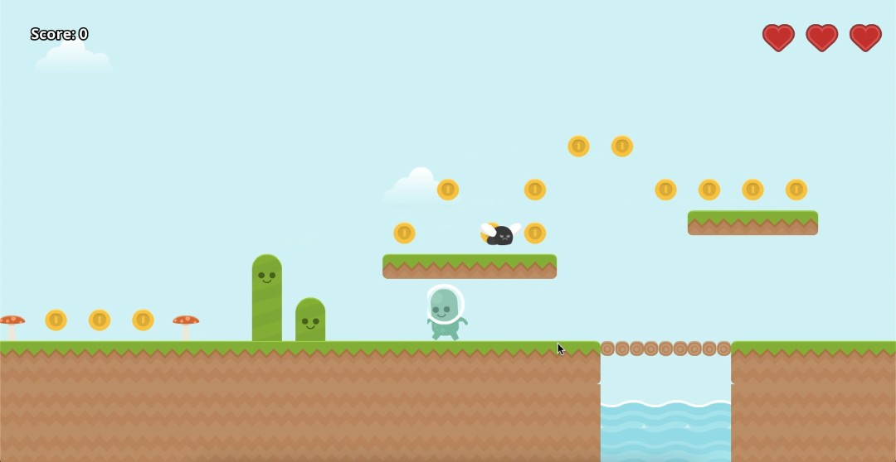
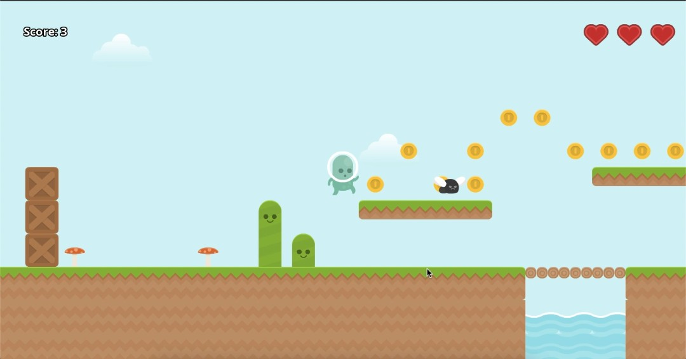
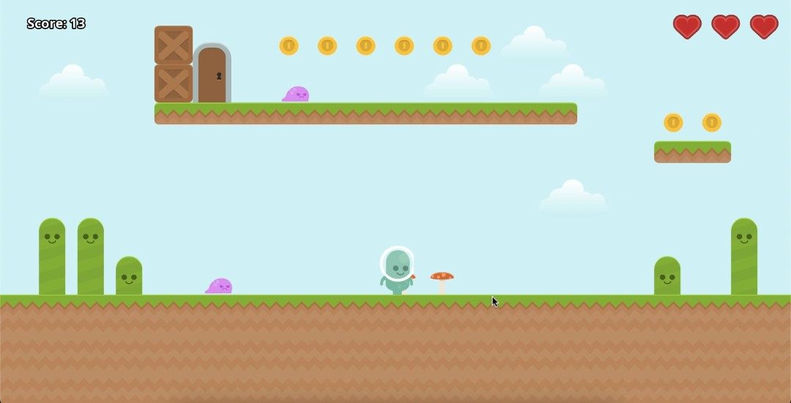

# Platformer Game

A simple 2D platformer built with C++ and SFML, featuring basic player movement, collision detection, and level design. The game uses **Kenney's platformer assets** for tiles, characters, and background visuals.

---

## 📌 Features
- Player movement with running and jumping mechanics
- Collision detection with tiles and platforms
- Collectible items and enemies
- Simple level structure using a `map.txt` file
- Organized assets for easy customization

---

## 🎮 Controls
| Key | Action |
|-----|--------|
| **Left Arrow**  | Move Left |
| **Right Arrow** | Move Right |
| **Space**       | Jump |

---
## 📸 Screenshots 



---

## 🛠 Installation & Setup

### 1️⃣ Clone the Repository
```bash
git clone https://github.com/pritam-bsk/Platformer_game.git
cd Platformer_game
```

### 2️⃣ Install Dependencies 
Make sure you have downloaded:
- c++17 or later
- SFML @2.6.2
  
### 3️⃣ Build with gcc and run
#### on **Linux** & **macOS** build using
```bash
g++ -std=c++17 src/*.cpp -o PlatformerGame \
    -I/opt/homebrew/include \
    -L/opt/homebrew/lib \
    -lsfml-graphics -lsfml-window -lsfml-system -lsfml-audio
```
To run:
```bash
./PlatformerGame
```
#### on Windows build Using 
```bash
g++ -std=c++17 src/*.cpp -o Platformer.exe ^
-I C:\SFML\include ^
-L C:\SFML\lib ^
-lsfml-graphics -lsfml-window -lsfml-system -lsfml-audio
```
To run:
```bash
Platformer.exe
```
